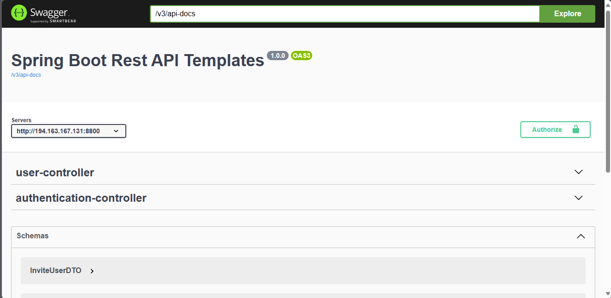

## SPRING BOOT TEMPLATE

This is a template for a Spring Boot project. It includes the following features:

- Spring Boot 2.5.0
- Spring Security
- Spring Data JPA
 - Spring Mail
 - OpenAPI 3.0

## Getting Started
 - Clone the project :
```bash
git clone <url>
```

 - Edit the application.properties file :
```
  cd src/main/resources
    nano application.properties
```
- Edit the following properties :
```
spring.datasource.url=<database_url>
spring.datasource.username=<database_username>
spring.datasource.password=<database_password>

spring.mail.username=<your email username>
spring.mail.password<your email password>
adminKey = <admin_registration_key>

app_name=<The name of your application>
client.host=<your backend host>
front.host=<your frontend host>
```
 - Install packages :
```bash
mvn clean install
```

 - Run the project :
```bash
mvn spring-boot:run
```
-  You can also run it with docker :
```bash
  docker build -t <image_name> .
  docker run -p <desired port>:<desired port> <image_name>
```
- Access the project :
```bash
http://localhost:<desired port>/swagger-ui.html
```

 - Then in the browser you will get a page like this :

 
## License
Apache License 2.0

